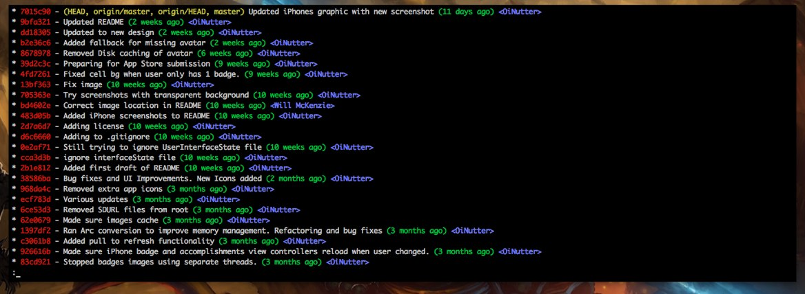

# Mon environnement de configuration **gitbash**
> C'est toujours un enfer de repartir à zéro sur une nouvelle machine et de se souvenir de ce qu'il faut installer 😊, ce mémo c'est pour me permettre de reconfigurer mon environnement de travail sur windows avec **ssh** et **rsync** fonctionnel et un bon **vim** prêt à l'emploie comme on l'aime. 

# 1) Installer Git pour windows
* Télécharger et installer [Git](https://git-scm.com/download/win) sur windows

# 2) Le **bashrc**
* Copier le fichier `.bashrc` dans le dossier `$HOME` de l'utilisateur

# 3) Vim
* Copier le fichier `.vimrc` dans le `$HOME` de l'utilisateur

# 4) Générer un clé ssh
* Pour générer une clé SSH, taper la commande `ssh-keygen`, uploader ensuite le `id_rsa.pub` sur le serveur

# 5) Pour installer `rsync`
1. Copier les fichiers `rsync.exe` et `rsync-ssl` dans le dossier `C:\Program Files\Git\usr\bin\`

2. Copier tout les fichiers `msys-zstd-1.dll` et `msys-xxhash-0.8.0.dll` dans le dossier `C:\Program Files\Git\usr\bin\`

# 6) Configuration **git**

Pour configurer **git** et avoir les bons alias qui facilite la vie, lancer la commande `./setup.sh`

* Le légendait `git lg` qu'on aime voir :

* La version courte de **git checkout** : `git co`
* La version courte de **git branch** `git br`
* La version courte de **git status** `git st`